# End-2-End Supervised Domain Adaptation

## Usage
### Requirements

- python >= 3.7
- imageio
- opencv
- tensorflow >= 2.4
- matplotlib
- jupyter notebook

### Train

You can use the following IPython notebooks: 
- `01-train-source-domain.ipynb` - to pre-train ISP on source domain
- `02-domain-adaptation.ipynb` - to make domain adaptation

### Convert to TfLite

Use `Model/main.py` to make convertion:

```
usage: main.py [-h] [--unet UNET] [--encoder ENCODER]

convert model

optional arguments:
  -h, --help         show this help message and exit
  --unet UNET        path to unet weights (default dann_zurich2mai_u_net.h5)
  --encoder ENCODER  path to encoder weights (default dann_zurich2mai_encoder.h5)
```

This script will save 3 models at the samr folder:
- model.tflite - model with input shape [1, 544, 960, 4];
- model_none.tflite - model with input shape [1, None, None, 4];
- model_128x128.tflite - model with input shape [1, 128, 128, 4];

### Inference

Use `TFLine/inference_tflite.py` to make inference:

```
usage: inference_tflite.py [-h] [--phone_dir PHONE_DIR] [--dslr_dir DSLR_DIR]
                           [--model_file MODEL_FILE] [--save_results]
                           [--save_dir SAVE_DIR]

optional arguments:
  -h, --help            show this help message and exit
  --phone_dir PHONE_DIR
  --dslr_dir DSLR_DIR
  --model_file MODEL_FILE
  --save_results
  --save_dir SAVE_DIR
```

For example:

```
python inference_tflite.py --phone_dir ~/Datasets/MAI2021_LearnedISP_valid_raw --model_file model_128x128.tflite --save_results --save_dir ~/Datasets/results
```


## Architecture
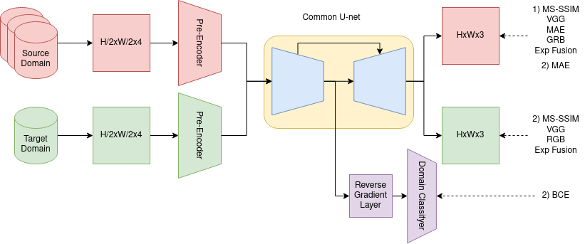

## Experiments

### Data

| Dataset             | Number of crops / images | Camera         |
| ------------------- | ------------------------ | -------------- |
| Zurich Raw2Rgb      | 46839                    | Sony IMX380    |
| MAI 2021            | 24161                    | Sony IMX586    |
| Samsung S7          |                          | Samsung S5K2L1 |

### Results of Domain Adaptation

- Source Domain - Zurich Raw2Rgb

| Target Dataset      | 10% of images (pasr/ssim) (~80 images) | 10 images    | 5 images     | 1 image      |
| ------------------- | -------------------------------------- | ------------ | ------------ | ------------ |
| MAI 2021            | 23.192/0.867                           | 23.145/0.860 | 21.713/0.790 | 19.082/0.775 |

- Source Domain - MAI 2021

| Target Dataset      | 10% of images (pasr/ssim) (~80 images) | 10 images | 5 images | 1 image |
| ------------------- | -------------------------------------- | --------- | -------- | ------- |
| Zurich Raw2Rgb      | 20.501/0.797                           |           |          |         |

- [Zurich -> MAI] Domain adaptation 1 image vs 10 (in full resolution)

| 10 images                              | 5 images                              | 1 image                               | Ground Trough                          |
| -------------------------------------- | ------------------------------------- | ------------------------------------- | -------------------------------------- |
| 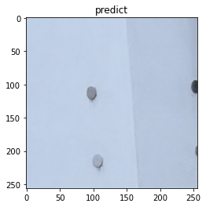 |  | 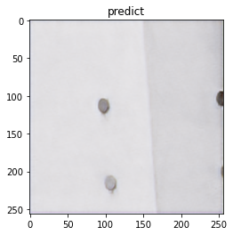 | 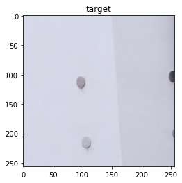 |
| 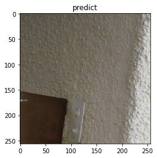 |  |  | 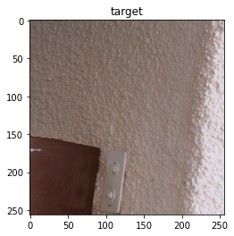 |
| 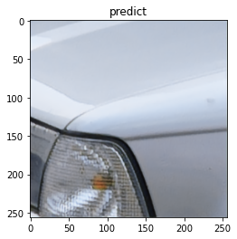 | 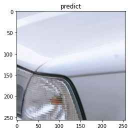 | 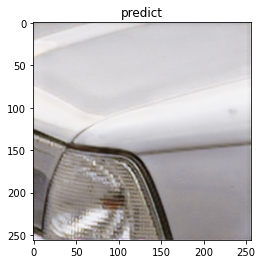 | 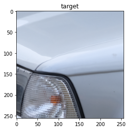 |
| 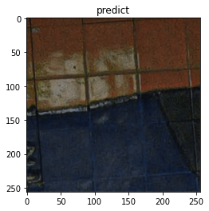 |  | 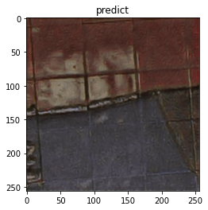 | 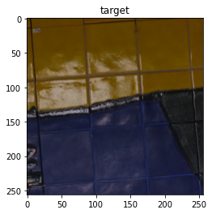 |
| 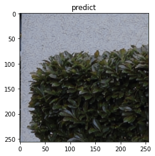 | 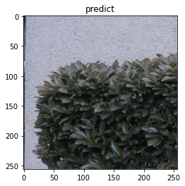 |  |  |

